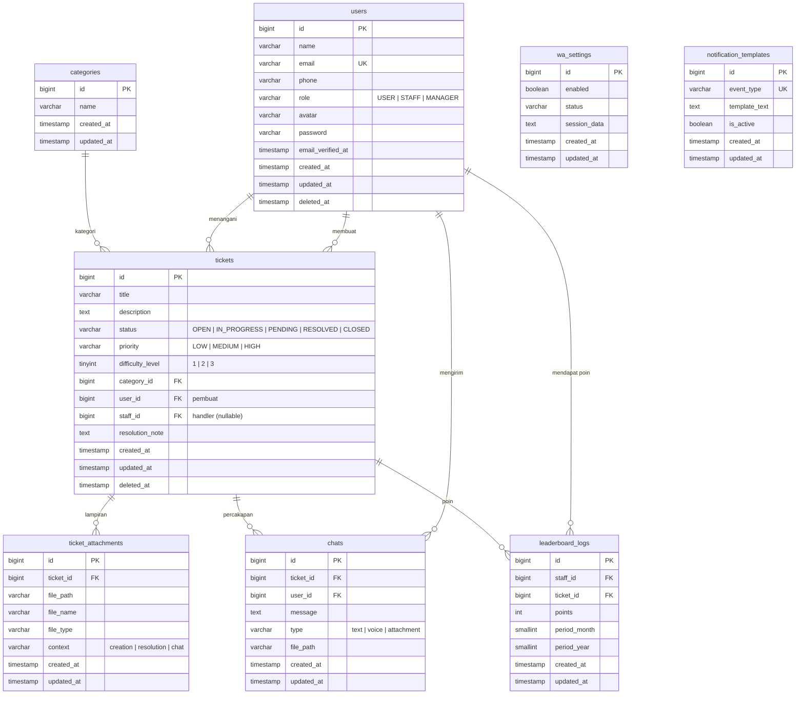

# IT Helpdesk & WhatsApp Gateway

Sistem manajemen tiket IT Helpdesk dengan notifikasi WhatsApp otomatis, live chat per tiket, dan leaderboard gamifikasi untuk staff.

## Fitur Utama

- **Manajemen Tiket** — Buat, klaim, assign, resolve, dan tutup tiket dengan state machine (OPEN → IN_PROGRESS → PENDING → RESOLVED → CLOSED)
- **Role-Based Access** — 3 role (USER, STAFF, MANAGER) dengan permission berbeda di setiap halaman dan aksi
- **Live Chat per Tiket** — Chat real-time di setiap tiket menggunakan Laravel Reverb (WebSocket), dengan dukungan file attachment
- **WhatsApp Gateway** — Notifikasi otomatis ke WhatsApp saat tiket dibuat, diklaim, di-assign, di-resolve, atau ditutup. Menggunakan Baileys v7 sebagai microservice terpisah
- **Leaderboard Gamifikasi** — Poin untuk staff berdasarkan difficulty tiket yang diselesaikan (10 x difficulty level), dengan filter bulanan/tahunan
- **Profil & Avatar** — Edit profil, upload avatar, ganti password
- **File Attachment** — Upload lampiran saat buat tiket, resolve tiket, dan chat
- **Keamanan** — XSS sanitization, SQL injection protection, rate limiting, CSRF protection

## Tech Stack

| Komponen | Teknologi |
|----------|-----------|
| Backend | Laravel 12 (PHP 8.4) |
| Frontend | React 19 + TypeScript 5 (via Inertia.js v2) |
| Database | PostgreSQL 17 |
| Styling | Tailwind CSS v4 |
| Icons | Lucide React |
| Real-time | Laravel Reverb + Echo |
| WhatsApp | Baileys v7 (Node.js microservice) |

## ERD (Entity Relationship Diagram)



## Tabel Database

| Tabel | Deskripsi |
|-------|-----------|
| `users` | User dengan role (USER/STAFF/MANAGER), phone, avatar, soft deletes |
| `categories` | Kategori tiket (Hardware, Software, Jaringan, dll) |
| `tickets` | Tiket helpdesk dengan state machine, priority, difficulty level |
| `ticket_attachments` | File lampiran tiket (context: creation/resolution/chat) |
| `chats` | Pesan chat per tiket (text/voice/attachment) |
| `leaderboard_logs` | Log poin gamifikasi staff per periode |
| `wa_settings` | Konfigurasi WhatsApp Gateway (singleton) |
| `notification_templates` | Template notifikasi WhatsApp per event type |

## Ticket State Machine

```
OPEN ──────→ IN_PROGRESS ──────→ PENDING
  │               │                  │
  │               ▼                  ▼
  │          RESOLVED ←──────── IN_PROGRESS
  │               │
  ▼               ▼
CLOSED ←──── RESOLVED
```

| Transisi | Siapa yang boleh |
|----------|-----------------|
| OPEN → IN_PROGRESS | STAFF (klaim), MANAGER (assign) |
| IN_PROGRESS → PENDING | STAFF (handler), MANAGER |
| IN_PROGRESS → RESOLVED | STAFF (handler), MANAGER |
| PENDING → IN_PROGRESS | STAFF (handler), MANAGER |
| PENDING → RESOLVED | STAFF (handler), MANAGER |
| RESOLVED → CLOSED | MANAGER |
| RESOLVED → IN_PROGRESS | MANAGER |
| OPEN → CLOSED | MANAGER |

## Prasyarat

- **PHP** >= 8.2 dengan extensions: `pgsql`, `mbstring`, `xml`, `curl`, `zip`, `bcmath`, `intl`, `gd`
- **Composer** >= 2.x
- **Node.js** >= 20.x dan **npm** >= 10.x
- **PostgreSQL** >= 15.x

## Instalasi

### 1. Clone repository

```bash
git clone https://github.com/dickyprase/it-helpdesk-laravel.git
cd it-helpdesk-laravel
```

### 2. Install dependencies

```bash
composer install
npm install
```

### 3. Install WhatsApp microservice dependencies

```bash
cd wa-microservice && npm install && cd ..
```

### 4. Setup environment

```bash
cp .env.example .env
php artisan key:generate
```

Edit `.env` dan sesuaikan konfigurasi database:

```env
DB_CONNECTION=pgsql
DB_HOST=127.0.0.1
DB_PORT=5432
DB_DATABASE=it_helpdesk
DB_USERNAME=helpdesk
DB_PASSWORD=your_password
```

### 5. Buat database PostgreSQL

```bash
sudo -u postgres psql
```

```sql
CREATE USER helpdesk WITH PASSWORD 'your_password';
CREATE DATABASE it_helpdesk OWNER helpdesk;
GRANT ALL PRIVILEGES ON DATABASE it_helpdesk TO helpdesk;
\q
```

### 6. Jalankan migration dan seed data awal

```bash
php artisan migrate:fresh --seed
```

### 7. Setup storage

```bash
php artisan storage:link
```

### 8. Build frontend

```bash
npm run build
```

## Menjalankan Aplikasi

### Development (satu command)

```bash
npm run dev
```

Perintah ini otomatis menjalankan **3 service sekaligus**:

| Service | URL | Keterangan |
|---------|-----|------------|
| Laravel | http://localhost:8000 | Backend + Inertia SSR |
| Vite | http://localhost:5173 | Frontend hot reload |
| WhatsApp | http://localhost:3001 | WA Gateway microservice |

Buka aplikasi di: **http://localhost:8000**

Opsional — jalankan Reverb untuk real-time chat (terminal terpisah):
```bash
php artisan reverb:start
```

### Menjalankan service terpisah

```bash
# Terminal 1 — Laravel
php artisan serve

# Terminal 2 — Vite
npm run dev:vite

# Terminal 3 — WhatsApp Gateway
npm run dev:wa

# Terminal 4 — Reverb (opsional, untuk real-time chat)
php artisan reverb:start
```

## Akun Login Default

Setelah menjalankan `php artisan migrate:fresh --seed`, akun-akun berikut tersedia:

> **Password untuk semua akun:** `password`

| Email | Role | Nama |
|-------|------|------|
| `admin@helpdesk.test` | MANAGER | Admin Manager |
| `staff1@helpdesk.test` | STAFF | Staff Satu |
| `staff2@helpdesk.test` | STAFF | Staff Dua |
| `user1@helpdesk.test` | USER | User Satu |
| `user2@helpdesk.test` | USER | User Dua |

## Cara Penggunaan

### Sebagai USER
1. Login dengan akun USER
2. Klik **Buat Tiket** di dashboard atau halaman tiket
3. Isi judul, kategori, prioritas, deskripsi, dan lampiran (opsional)
4. Pantau status tiket di halaman **Daftar Tiket**
5. Buka detail tiket untuk melihat progress dan chat dengan staff

### Sebagai STAFF
1. Login dengan akun STAFF
2. Lihat tiket **Open** di halaman Daftar Tiket
3. Klik tiket lalu **Klaim Tiket** untuk mulai menangani
4. Set **Difficulty Level** (1/2/3) untuk menentukan poin
5. Chat dengan user pembuat tiket melalui floating chat
6. **Resolve** tiket dengan mengisi catatan resolusi
7. Lihat peringkat di halaman **Leaderboard**

### Sebagai MANAGER
1. Login dengan akun MANAGER
2. Lihat semua tiket dan **Assign Staff** ke tiket
3. **Tutup** tiket yang sudah resolved (poin otomatis diberikan ke staff)
4. Kelola **WhatsApp Gateway** di menu WhatsApp:
   - Hubungkan WhatsApp dengan scan QR code
   - Aktifkan/nonaktifkan notifikasi otomatis
   - Edit template notifikasi
   - Kirim pesan test
5. Pantau performa staff di **Leaderboard**

### WhatsApp Gateway
1. Login sebagai MANAGER, buka menu **WhatsApp**
2. Klik **Hubungkan** — QR code akan muncul di dashboard
3. Buka WhatsApp di HP → Menu → Perangkat Tertaut → Tautkan Perangkat → Scan QR
4. Setelah terhubung, aktifkan toggle **Notifikasi**
5. Notifikasi otomatis terkirim saat:
   - Tiket dibuat → ke user pembuat
   - Tiket diklaim → ke user pembuat
   - Tiket di-assign → ke staff yang di-assign
   - Tiket pending → ke user pembuat
   - Tiket resolved → ke user pembuat
   - Tiket ditutup → ke user pembuat + staff handler

## User Roles

| Role | Akses |
|------|-------|
| **USER** | Buat tiket, lihat tiket sendiri, chat pada tiket sendiri |
| **STAFF** | Klaim/tangani tiket, set difficulty/pending/resolve, chat, lihat leaderboard |
| **MANAGER** | Semua akses STAFF + assign staff, tutup tiket, kelola WhatsApp Gateway & template |

## Keamanan

| Aspek | Implementasi |
|-------|-------------|
| XSS | Filename sanitization (`Sanitizer::fileName`), React auto-escape, `dangerouslySetInnerHTML` hanya untuk server-generated pagination |
| SQL Injection | Eloquent parameterized queries, LIKE wildcard escape (`Sanitizer::escapeLike`), enum validation untuk filter |
| CSRF | Laravel CSRF token otomatis di semua form |
| Rate Limiting | Login (5/min), Register (3/min), Chat (30/min) |
| Auth | Session-based dengan bcrypt hashing, role middleware, policy authorization |
| File Upload | Validasi tipe & ukuran, path traversal protection, sanitized filenames |
| Session | Expired sessions dibersihkan otomatis setiap jam |

## Perintah Artisan Berguna

```bash
php artisan migrate:fresh --seed   # Fresh migration + seed
php artisan optimize:clear         # Clear semua cache
php artisan schedule:run           # Jalankan scheduled tasks (session cleanup)
php artisan reverb:start           # Start WebSocket server
php artisan route:list             # Lihat semua routes
```

## Struktur Folder

```
app/
├── Enums/               # PHP Enums (UserRole, TicketStatus, dll)
├── Events/              # Broadcast events (MessageSent)
├── Helpers/             # Sanitizer utility class
├── Http/
│   ├── Controllers/     # TicketController, ChatController, dll
│   ├── Middleware/       # EnsureUserHasRole
│   └── Requests/        # Form request validation
├── Models/              # Eloquent models (8 models)
├── Policies/            # TicketPolicy
├── Providers/           # AppServiceProvider (rate limiting)
└── Services/            # TicketStateMachine, WhatsAppNotificationService

resources/js/
├── Components/
│   ├── Chat/            # FloatingChat, ChatInput, ChatMessage
│   ├── Ticket/          # StatusBadge, PriorityBadge
│   └── ui/              # ThemeProvider, Skeleton
├── Layouts/             # AuthenticatedLayout, GuestLayout
├── Pages/
│   ├── Admin/WhatsApp/  # WhatsApp Gateway management
│   ├── Auth/            # Login, Register
│   ├── Leaderboard/     # Staff leaderboard
│   ├── Profile/         # Profile edit
│   └── Tickets/         # Index, Create, Show
└── types/               # TypeScript type definitions

wa-microservice/         # WhatsApp Gateway (Node.js + Baileys)
├── index.js             # Express server + Baileys connection
├── package.json
└── session/             # WhatsApp session persistence (gitignored)
```

## License

[MIT License](LICENSE)
